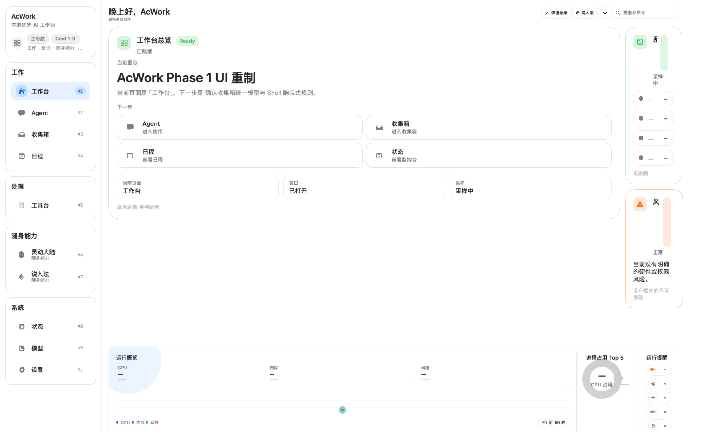

# AcMind

AcMind is an open-source, local-first macOS workspace for persistent desktop interaction, information capture, voice input, system monitoring, and AI-assisted organization.

English | [简体中文](README.zh-CN.md)




## Overview

AcMind is a desktop workspace, not just a chat shell. It combines capture, extraction, organization, monitoring, and persistent interaction in one macOS app so a user can keep working without constantly switching between disconnected tools.

The repository currently contains:

- a native macOS workbench experience
- a companion / continent-style persistent surface
- desktop capsule entry points
- global shortcuts and hot corners
- voice input and ASR routing
- clipboard, screenshot, document, and web capture flows
- AI distillation and export pipelines
- system monitoring surfaces
- local and cloud model routing
- agent-oriented tools and schedule-related surfaces

## Why AcMind

AcMind is designed for knowledge workers and power users who want one place to:

- capture something quickly
- inspect system state without leaving the workflow
- turn raw input into structured notes
- keep a persistent desktop surface available for repeated actions
- route work between local and cloud AI providers when needed

The project tries to feel like a real system tool: calm, direct, and useful, with the fewest possible interruptions.

## Current Status

The repository is buildable from source with both SwiftPM and Xcode.

- `swift package resolve` works
- `swift build` works
- `xcodebuild ... build` works for the `AcMind` scheme with signing disabled
- `swift test` currently has documented known failures across multiple suites, so the suite is not green yet
- there is no public release tag in this checkpoint

That means this repo is credible and reproducible, but not yet release-polished.

## Features

Feature maturity in this repository is intentionally conservative.

| Area | Status | Notes |
|---|---|---|
| Native macOS workbench | Available | The main workspace shell and navigation are implemented in the app target and feature views. |
| Dynamic continent / companion window | Available | Persistent companion surfaces and collapsed / expanded states are implemented. |
| Desktop capsule | Available | A lightweight floating entry point exists. |
| Global shortcuts | Available | Hotkey registration and persistence are implemented. |
| Hot corners | Available | Corner-triggered actions and overlays exist. |
| Clipboard collection | Available | Clipboard capture and pinning workflows are present. |
| System monitoring | Available | CPU, memory, disk, network, battery, and process surfaces are implemented. |
| Obsidian export | Available | Export flows target an Obsidian vault / local note workflow. |
| Voice input | Beta | Voice entry surfaces, recording, and permission handling exist, but the feature depends on system permissions and provider setup. |
| ASR | Beta | Multiple ASR providers are wired, but outcomes depend on the selected backend and environment. |
| Screenshot capture | Beta | Screenshot export and preview tooling are present, but this is still a workflow area rather than a polished end-user feature. |
| Document processing | Beta | PDF / DOCX / web capture and distillation paths exist, but the pipeline should still be treated as evolving. |
| AI distillation | Beta | Markdown distillation and structured output helpers are implemented, but the workflow is still under active refinement. |
| Local AI provider support | Beta | Local provider routing exists, including Ollama-oriented paths. |
| OpenAI-compatible provider support | Beta | OpenAI-compatible routing exists, but requires user configuration and credentials. |
| Agent functionality | Beta | Agent-related models, services, and UI surfaces are present, but this area is still maturing. |
| Scheduling | Beta | Schedule-related models and services exist, but they should still be treated as evolving integration points. |
| Automation | Planned | No separate public automation product claim is made in this checkpoint. |

## Screenshots

Hero screenshot:


Additional current exports and reference images live under `docs/screenshots/` and `docs/refactor/`.

## Requirements

- macOS 14.0 or later
- Xcode 17.x or later
- Swift 6 toolchain via Xcode
- Optional: local AI backends such as Ollama, if you want to use local model routing
- Optional: provider credentials stored locally for cloud-backed features

Permissions used by the current implementation include:

- Microphone, for voice input
- Speech Recognition, for ASR-backed voice workflows
- Accessibility, for text insertion and system interaction
- Screen Recording, for screenshot and capture workflows
- Full Disk Access, for file-heavy workflows where the app needs broader filesystem visibility
- Notifications, for user-facing system feedback

API keys are stored locally through the app's secret storage, with Keychain-based storage available and a plaintext fallback in local settings when that preference is selected.

## Build from Source

Swift package validation:

```bash
swift package resolve
swift build
swift test
```

Important note: `swift test` currently has documented known failures across multiple suites. Do not treat the suite as passing until the baseline document says otherwise.

Xcode application build:

```bash
xcodebuild \
  -project AcMind.xcodeproj \
  -scheme AcMind \
  -configuration Debug \
  -destination 'platform=macOS' \
  CODE_SIGNING_ALLOWED=NO \
  CODE_SIGNING_REQUIRED=NO \
  build
```

To locate the built app bundle, inspect the build settings instead of hard-coding a DerivedData path:

```bash
xcodebuild \
  -project AcMind.xcodeproj \
  -scheme AcMind \
  -configuration Debug \
  -destination 'platform=macOS' \
  CODE_SIGNING_ALLOWED=NO \
  CODE_SIGNING_REQUIRED=NO \
  -showBuildSettings | rg 'TARGET_BUILD_DIR|FULL_PRODUCT_NAME'
```

The bundle path is `"$TARGET_BUILD_DIR/$FULL_PRODUCT_NAME"`, which resolves to `AcMind.app` in the Xcode build output directory.

## Run the App

Recommended local workflow:

1. Open `AcMind.xcodeproj` in Xcode.
2. Select the `AcMind` scheme.
3. Choose your local Mac destination.
4. Configure signing if you want a signed developer build.
5. Build and run.

If you are using the command line, build first and then open the bundle from the build settings path above. `swift build` validates the package targets, but it does not produce `./.build/debug/AcMind.app`.

## Permissions and Privacy

AcMind is local-first, but it is not magically offline in every configuration. What leaves the device depends on the provider and workflow you choose.

- Voice input needs microphone and speech permissions.
- Text insertion and some desktop interactions rely on Accessibility.
- Screenshot capture needs Screen Recording.
- Some file-heavy workflows need broader file access.
- Global shortcuts are handled through registered hotkeys, not through a keyboard logger.
- Cloud providers receive whatever prompt, file, or capture data you explicitly route to them.
- Local model workflows stay on-device, but their outputs and caches still live in local storage.
- API credentials are stored locally, preferably in Keychain.
- No explicit telemetry pipeline was identified in the audited codebase.

Users can revoke permissions in System Settings → Privacy & Security. Local data can be cleared by removing the app's stored settings, vault data, and secret material from the machine.

## Project Architecture

AcMind is split into a few broad layers:

- `App/` for app lifecycle, top-level orchestration, and window routing
- `Features/` for user-facing surfaces such as the companion, native workspace, sidebar, and specialized panels
- `AcMindKit/` for reusable core models, services, and infrastructure
- `Design/` for visual and interaction system material
- `Resources/` for app assets
- `Vendor/` for third-party source and dependencies
- `docs/` for architecture notes, screenshots, audits, and handoff material

The key architectural idea is that the same shell and service layer support multiple surfaces, instead of each surface reinventing the app around itself.

## AcMindKit

`AcMindKit` is the reusable core. It contains the app's service and model layer, including:

- storage and migration
- permissions
- hotkeys
- voice and ASR routing
- clipboard and capture flows
- system status readers and formatters
- AI provider routing
- agent services
- schedule-related services
- export and distillation helpers

If another Swift macOS project needs a similar split between an app shell and a reusable service layer, `AcMindKit` is the part most worth studying first.

## Known Limitations

- `swift test` currently has documented known failures across multiple suites.
- `swift build` does not create `./.build/debug/AcMind.app`; use Xcode builds for the app bundle.
- Some feature areas depend on macOS permissions or external provider setup.
- Several areas are still evolving, especially agent, scheduling, automation, and some capture pipelines.
- This repository is not yet at a public release milestone.

See [`docs/testing-and-build-baseline.md`](docs/testing-and-build-baseline.md) for the verified build and test baseline, and [`docs/privacy-and-permissions.md`](docs/privacy-and-permissions.md) for the current permission and data-flow notes.

## Roadmap

The near-term roadmap is intentionally practical. See [`ROADMAP.md`](ROADMAP.md) for the current planning view.

1. Stabilize the current UI and layout test surface.
2. Keep the community files and GitHub Actions aligned with the current release baseline.
3. Tighten privacy and security documentation around permissions, secrets, and local data handling.
4. Continue reducing doc drift between source code, screenshots, and handoff notes.
5. Prepare the first public alpha release once the surrounding hygiene is in place.

Draft alpha release notes live in [`CHANGELOG.md`](CHANGELOG.md) and [`docs/releases/v0.1.0-alpha.md`](docs/releases/v0.1.0-alpha.md).

## Contributing

Contributions are welcome, especially in areas that improve correctness, readability, reproducibility, and safety. See [`CONTRIBUTING.md`](CONTRIBUTING.md) for the baseline workflow and validation expectations.

- Open a GitHub issue for a bug report or feature request.
- Open a pull request for a focused change.
- Keep changes scoped and reproducible, especially for build, test, and documentation updates.
- When adding or changing a feature surface, update the relevant screenshots or notes if they help explain the new state.

## Security

Please do not report security issues as public issues. See [`SECURITY.md`](SECURITY.md) for the private reporting path and current security limitations.

Private vulnerability reporting through GitHub Security Advisories is the preferred path once the repository enables it. Until then, keep vulnerability discussions private and avoid posting secrets, credentials, or exploit details in public threads.

## License

MIT
