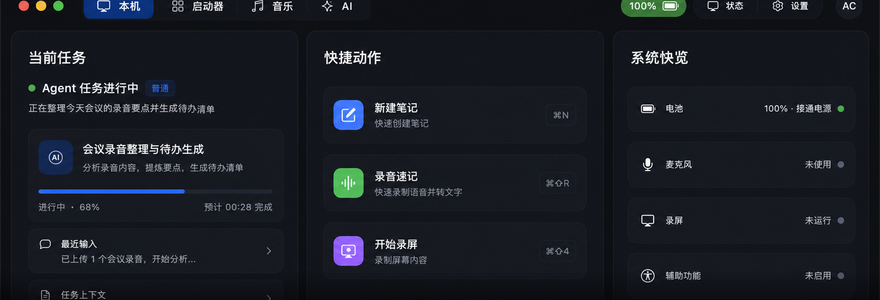
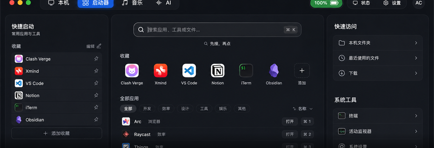
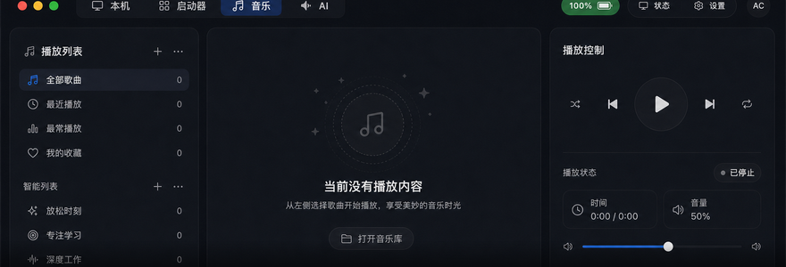
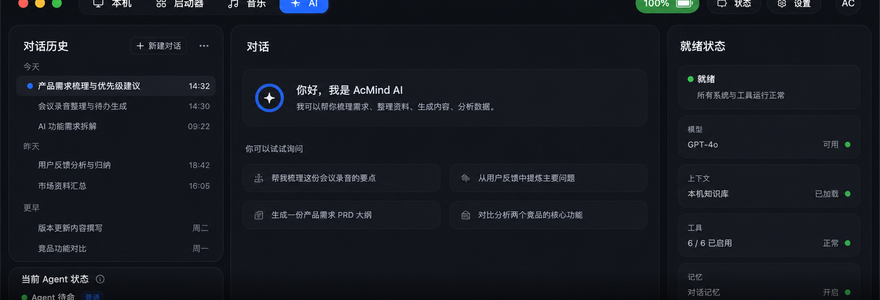
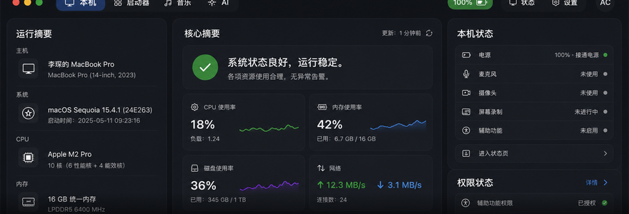
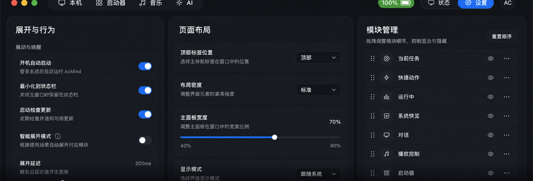

# AcMind 六页理想态设计稿

> 目标不是把页面做得更“炫”，而是把它们做得更像一套真正可长期使用的系统工具。
> 
> 最终容器必须统一锁定为 880 × 300，所有页面、所有参考图、所有实现稿都必须以这个尺寸为准。

## 这份设计稿要解决什么

当前六个界面已经比之前干净，但还存在两个核心问题：

1. 同一产品里的页面气质还不够统一，壳层、卡片、说明文字和控件语气偶尔会分叉。
2. 每个页面都在尽量讲很多事，导致“主任务”不够突出，用户要先扫描半天才能知道这页最重要的东西是什么。

所以这次的理想态，不是增加更多内容，而是把内容压到更少，把容器统一得更强，把每页的职责说得更清楚。

## 交互预算

如果这些页面要让人第一眼就感到“更少的界面，更快的动作，更明确的反馈”，那就不能只收 layout，还要收 interaction budget。

- 每页只保留 1 个主动作。
- 每页首屏最多 3 个高优先级次动作。
- 状态切换要有立即可见反馈，不要只改数据值。
- 反馈动画时长控制在 150 到 250 ms。
- 空态、处理中、不可用状态必须有明确文字。
- 同一状态不要在同一页重复解释两次以上。

## 全局设计原则

### 1. 统一壳层

六个页面必须共享同一套外框、边距、顶栏、底栏、圆角、阴影和网格节奏。

允许变化的只有：

- 页面内部内容
- 卡片里的信息密度
- 重点状态是否激活

不允许变化的包括：

- 顶栏高度
- 三列容器比例
- 外边距
- 卡片圆角语法
- 卡片阴影强度
- 底栏高度

### 2. 单屏优先

每个页面都必须在首屏讲完核心结论。

不能依赖滚动完成理解，不能把关键状态藏到下方。

### 3. 图形优先，短句辅助

能用状态点、数值、进度、条形、矩阵表达的，不要换成长句解释。

解释文字只保留：

- 页面任务
- 状态结论
- 必要的补充说明

### 4. 低噪声高密度

信息要密，但不能乱。

正确做法是：

- 让主卡更完整
- 让次级卡更轻
- 让按钮更少
- 让说明更短

错误做法是：

- 每个模块都放一段说明
- 每行都附带一个菜单
- 每个状态都再解释一次

## 统一壳层基线

所有页面建议固定在同一套基准上：

### 固定尺寸基线

这版设计稿按 880 × 300 的展开态面板锁定，所有尺寸都以这个基线为准。这里不是“接近 880 × 300 的视觉感觉”，而是字面意义上的 880 × 300 容器。

如果要出图，参考图也必须服务于这个容器，不允许把页面稿画成 4:3、16:9 或任何别的海报画幅。

这里说的是你当前产品里的展开态，不是最小化后的状态条。

#### 外层壳层

| 项目 | 尺寸 |
|---|---:|
| 参考画布 | 880 × 300 |
| 外层窗口圆角 | 14 px |
| 顶栏高度 | 34 px |
| 底栏高度 | 28 px |
| 顶部内容留白 | 12 px |
| 底部内容留白 | 12 px |
| 左右外边距 | 12 px |

#### 三列主布局

| 项目 | 尺寸 |
|---|---:|
| 左列宽度 | 248 px |
| 中列宽度 | 328 px |
| 右列宽度 | 248 px |
| 列间距 | 16 px |
| 页面内容区总宽 | 856 px |
| 页面主体区总高 | 214 px |

#### 折叠态状态条

折叠态是最小化后的状态条，只保留快速判断和少量状态入口，不承载完整页面结构。

| 项目 | 尺寸 |
|---|---:|
| 折叠态容器宽度 | 880 px |
| 折叠态容器高度 | 30 px |
| 折叠态内容留白 | 10 px |
| 折叠态图标尺寸 | 11 px |

#### 卡片与行

| 项目 | 尺寸 |
|---|---:|
| 主卡圆角 | 18 px |
| 子卡圆角 | 12 px |
| 行卡圆角 | 10 px |
| 主卡内边距 | 12 px |
| 子卡内边距 | 10 px |
| 卡片间距 | 8 px |
| 行高基线 | 28 px |
| 列表项高 | 24 px |

#### 控件尺寸

| 项目 | 尺寸 |
|---|---:|
| 顶部页签高度 | 25 px |
| 顶部状态胶囊高度 | 25 px |
| 搜索框高度 | 30 px |
| 主按钮高度 | 24 px |
| 次级按钮高度 | 22 px |
| Toggle 行高 | 24 px |
| Slider 行高 | 24 px |
| 图标基准尺寸 | 12 px |
| 列表行图标尺寸 | 11 px |

#### 字号基线

| 文本角色 | 字号 |
|---|---:|
| 页面标题 | 15 px |
| 面板标题 | 13 px |
| 区块标题 | 12 px |
| 正文 | 11 px |
| 辅助说明 | 10 px |
| 元信息 | 9 px |

#### 视觉约束

- 外层圆角：统一，不得每页变化
- 内层卡片圆角：统一，不得混用多个风格
- 边框透明度：低，作为分隔，不作为装饰
- 阴影：弱，只承担层次感
- 选中态：只给当前页和当前模块，不给所有按钮都上颜色

#### 位置规则

- 顶栏始终贴顶，不能下移
- 底栏始终贴底，不能漂浮
- 左中右三列在所有页面里必须对齐
- 所有主要卡片的标题基线尽量对齐
- 左列和右列的首卡顶部必须与中列首卡顶部对齐
- 中列的主卡允许更高，但不能破坏左右列的整体秩序

## 开发实现对照表

下面这张表把设计规格和当前代码里的 token 对上，方便直接改 SwiftUI。

这份设计稿的画布基线对应的是你当前产品里的 880 × 300 展开态面板。  
如果代码里同时存在 legacy `NotchV2*Page` 和 `DynamicContinent*Page`，请把 `DynamicContinent*Page` 视作展开态的对齐基线。

| 设计规格 | 代码入口 | 当前 token / 文件 | 备注 |
|---|---|---|---|
| 参考画布 880 × 300 | 顶层壳层 | `NotchV2DesignTokens.expandedWidth` / `NotchV2DesignTokens.expandedOverviewHeight` | 这是当前展开态面板的基线 |
| 顶栏高度 34 px | 顶栏 | `NotchV2DesignTokens.topBarHeight` | 现在是全局顶栏基准，高度应保持一致 |
| 底栏高度 28 px | 底栏 | `NotchV2DesignTokens.dashboardFooterHeight` | 底部状态条高度统一用这个值 |
| 左列宽度 248 px | 三列布局 | `CompanionLayoutTokens.templateAColumnWidth` / `DynamicContinentLayoutMetrics.leftColumnWidth` | 左右列对称时都走这个宽度 |
| 中列宽度 328 px | 三列布局 | `DynamicContinentLayoutMetrics.centerColumnWidth` | 中列是主内容区，允许承载更完整的主卡 |
| 列间距 16 px | 三列布局 | `CompanionLayoutTokens.majorColumnSpacing` | 左中右之间的固定节奏 |
| 主卡圆角 18 px | 卡片 | `CompanionLayoutTokens.cardCornerRadius` / `NotchV2DesignTokens.cardRadius` | 统一所有主卡和核心容器的圆角语法 |
| 子卡圆角 12 px | 子卡 | `NotchV2DesignTokens.rightCardRadius` | 适合设置页、状态页里的小块 |
| 页内卡间距 8 px | 纵向节奏 | `CompanionLayoutTokens.panelSpacing` / `NotchV2DesignTokens.cardSpacing` | 页面内模块之间保持一致 |
| 主标题 15 px | 页面主标题 | `NotchV2DesignTokens.Typography.title` | 适合页面级标题或核心结论 |
| 面板标题 13 px | 面板标题 | `CompanionLayoutTokens.panelTitleSize` | 当前主面板的标题层级 |
| 正文 11 px | 正文 | `NotchV2DesignTokens.Typography.body` | 用于卡片正文和主要说明 |
| 辅助说明 10 px | 辅助说明 | `NotchV2DesignTokens.Typography.caption` / `CompanionLayoutTokens.metadataSize` | 用于副标题、备注、状态补充 |
| 图标 12 px | 图标 | `CompanionLayoutTokens.panelHeaderIconSize` / `NotchV2DesignTokens.Typography` 体系 | 图标大小和文字层级要跟着统一 |

### 页面到代码文件的对应关系

| 页面 | 主要代码文件 | 主要布局入口 |
|---|---|---|
| 本机页 | `Features/Companion/DynamicContinent/DynamicContinentPages.swift` | `DynamicContinentTodayPage` |
| 启动器页 | `Features/Companion/NotchV2LauncherPage.swift` | `NotchV2LauncherPage` |
| 音乐页 | `Features/Companion/NotchV2MusicPage.swift` | `NotchV2MusicPage` |
| AI 页 | `Features/Companion/NotchV2AgentPage.swift` | `NotchV2AgentPage` |
| 系统状态页 | `Features/Companion/DynamicContinent/DynamicContinentPages.swift` | `DynamicContinentSystemStatusPage` |
| 设置页 | `Features/Companion/NotchV2SettingsPage.swift` | `NotchV2SettingsPage` |
| 日程页 | `Features/Companion/DynamicContinent/DynamicContinentPages.swift` / `Features/Native/Schedule/` | `DynamicContinentSchedulePage` / existing schedule surface | 不作为这份六页主图的一部分，但必须遵守同一套壳层和 token 语法 |

### 推荐的实现顺序

如果要把这份设计稿真正变成代码，推荐按这个顺序做：

1. 先锁壳层尺寸和三列宽度。
2. 再锁顶栏、底栏、卡片圆角和卡片阴影。
3. 然后对齐六个页面的标题字号和行高。
4. 最后再调每页内部内容密度。

这样做的好处是，先解决骨架，再解决内容，不会出现“内容调好了，壳又歪了”的情况。

## 六个页面的理想状态

### 页面位置模板

下面这些位置是这版设计稿的固定模板。后续页面如果要调整内容，只能在这个模板内部换内容，不能重新发明一套布局。

| 页面 | 左列 | 中列 | 右列 |
|---|---|---|---|
| 本机页 | `x=12, y=46, w=248, h=214` | `x=276, y=46, w=328, h=214` | `x=620, y=46, w=248, h=214` |
| 启动器页 | `x=12, y=46, w=248, h=214` | `x=276, y=46, w=328, h=214` | `x=620, y=46, w=248, h=214` |
| 音乐页 | `x=12, y=46, w=248, h=214` | `x=276, y=46, w=328, h=214` | `x=620, y=46, w=248, h=214` |
| AI 页 | `x=12, y=46, w=248, h=214` | `x=276, y=46, w=328, h=214` | `x=620, y=46, w=248, h=214` |
| 系统状态页 | `x=12, y=46, w=248, h=214` | `x=276, y=46, w=328, h=214` | `x=620, y=46, w=248, h=214` |
| 设置页 | `x=12, y=46, w=248, h=214` | `x=276, y=46, w=328, h=214` | `x=620, y=46, w=248, h=214` |

### 页面内部主卡模板

#### 本机页

- 左列主卡：`248 × 214`
- 中列主卡：`328 × 214`
- 右列主卡：`248 × 214`

#### 启动器页

- 左列主卡：`248 × 214`
- 中列顶部搜索区：`328 × 52`
- 中列常用应用区：`328 × 66`
- 中列全部应用区：`328 × 96`
- 右列主卡：`248 × 214`

#### 音乐页

- 左列主卡：`248 × 214`
- 中列播放区：`328 × 164`
- 中列底部播放条：`328 × 42`
- 右列主卡：`248 × 214`

#### AI 页

- 左列历史区：`248 × 108`
- 左列状态区：`248 × 98`
- 中列对话头部区：`328 × 54`
- 中列快捷提问区：`328 × 52`
- 中列输入区：`328 × 90`
- 右列主卡：`248 × 214`

#### 系统状态页

- 左列主卡：`248 × 214`
- 中列健康结论区：`328 × 64`
- 中列指标区：`328 × 116`
- 中列底部跳转区：`328 × 34`
- 右列上半状态区：`248 × 96`
- 右列下半权限区：`248 × 118`

#### 设置页

- 左列主卡：`248 × 214`
- 中列主卡：`328 × 214`
- 右列主卡：`248 × 214`

### 1. 本机页

页面角色：总览仪表盘。

这一页只回答一个问题，当前机器和当前工作流是不是正常。

必须保留：

- 当前任务
- 运行摘要
- 快捷动作
- 系统快览

应该继续收掉：

- 次级说明句
- 重复的状态标签
- 没有动作价值的工具按钮

理想结构：

- 左列只讲“现在在做什么”
- 中列只放最常用的 2 到 3 个动作
- 右列只讲“机器状态是否正常”

页面语气：

- 像系统总览
- 不像功能导航
- 不像多层报表

### 2. 启动器页

页面角色：极快的搜索与启动工具。

这一页的中心不是应用列表，而是搜索。

必须保留：

- 顶部搜索框
- 常用应用
- 全部应用

应该继续收掉：

- 过多解释文字
- 过重的快捷入口装饰
- 与搜索无关的额外控制

理想结构：

- 搜索框放在视觉中心偏上
- 常用应用作为第一视觉焦点
- 全部应用作为结果列表，而不是另一个主视觉

页面语气：

- 像 Raycast 或 Spotlight 的延展版
- 不像分类目录
- 不像 App Store

### 3. 音乐页

页面角色：安静的播放器控制台。

这一页的主角永远是“当前播放内容”。

必须保留：

- 播放列表
- 正在播放
- 播放控制

应该继续收掉：

- 重复的空状态说明
- 过多的辅助信息块
- 不必要的控制说明

理想结构：

- 左边负责上下文
- 中间负责歌曲和封面
- 右边负责控制和状态

页面语气：

- 像一个成熟播放器
- 不像媒体功能拼盘

### 4. AI 页

页面角色：对话工作台。

这一页的核心不是“AI 很强”，而是“我可以马上开始干活”。

必须保留：

- 对话历史
- 对话区
- 快速提问
- 输入框
- 发送动作

应该继续收掉：

- 过多的状态卡
- 多余的快捷指令堆叠
- 让人分心的“准备就绪”装饰块

理想结构：

- 左侧是历史，不是菜单
- 中间是输入和对话，不是海报
- 右侧只保留最轻的状态确认

页面语气：

- 像一个专业写作助手或分析助手
- 不像聊天应用

### 5. 系统状态页

页面角色：状态监控面板。

这一页只回答一个问题，机器现在是不是健康。

必须保留：

- 运行摘要
- 核心摘要
- 本机状态
- 权限状态

应该继续收掉：

- 重复的状态语句
- 不必要的解释文案
- 过多小卡的视觉噪声

理想结构：

- 左列给机器信息和基础参数
- 中列先给健康结论，再给 4 到 6 个关键指标
- 右列给设备状态和权限状态

页面语气：

- 像仪表盘
- 不是系统设置页
- 不是性能报表页

### 6. 设置页

页面角色：配置控制台。

这一页最适合承担“偏专业、偏结构化”的任务，但仍然要安静。

必须保留：

- 展开与行为
- 页面布局
- 子模块管理

应该继续收掉：

- 每行重复的辅助说明
- 过多的并列控制
- 让用户误以为这是“另一套产品”的视觉差异

理想结构：

- 左列是运行行为
- 中列是布局参数
- 右列是模块排序与显隐

页面语气：

- 像 macOS 的专业偏好设置面板
- 不像实验室面板

## 组件级统一规则

### 卡片

- 所有主卡、子卡和行卡都使用同一套圆角语法
- 同层级卡片尽量同高
- 边框用来分层，不用来装饰
- 阴影只承担轻微悬浮感

### 按钮

- 主按钮只保留一个
- 次级按钮全部降级成轻量胶囊或菜单
- 不能让一页里出现太多不同形状的操作控件

### 文案

- 标题短
- 副标题更短
- 状态词直接说结果
- 少用“帮助用户理解”的解释句

### 图标

- 同一套图标风格
- 同一套图标尺寸层级
- 不混用粗糙、拟物、装饰化图标

## 视觉落地标准

如果要判断一页是否已经达到理想态，可以用下面的标准：

### 看第一眼

用户能不能在 2 秒内说出：

- 这页是做什么的
- 当前最重要的状态是什么
- 我下一步最可能点哪里

### 看第二眼

用户能不能在 5 秒内判断：

- 哪块是主内容
- 哪块是辅助信息
- 哪些控件只是次级动作

### 看结构

如果把文字都删掉，只剩卡片、图标、状态点、按钮，这页是否还成立。

如果成立，说明结构是稳的。

## 本次六页的理想态参考图

下面六张图是这份设计稿的视觉参考，目标是把“统一壳层 + 清晰职责 + 低噪声高密度”同时落到位。

说明：

- 图片来自 image2.0 生成的最终风格参考。
- 图片表达的是同一套 880 × 300 容器语法下的最终样式，不是额外的海报画布。
- 这 6 张 PNG 资产本身已经统一导出为 880 × 300，便于直接作为最终参考图使用。
- 六张图采用一致的下移裁切节奏和底部柔化收口，避免出现“被硬切断”的感觉。
- 后续实现时，代码和 UI 截图都必须与 880 × 300 容器对齐。

### 1. 本机页

### 2. 启动器页

### 3. 音乐页

### 4. AI 页

### 5. 系统状态页

### 6. 设置页

## 落地验收清单

下面这些条件满足后，才算真的打磨到位：

- 六个页面共享同一套外壳和网格
- 顶栏和底栏在所有页面里完全一致
- 卡片边框和阴影不再抢内容
- 启动器页明显比现在更像搜索工具
- AI 页的输入框是唯一主要动作
- 系统状态页先给结论，再给细项
- 设置页仍然清晰，但不再“控制感过重”

## 反向检查

如果以后再改版，以下情况一出现，就说明又开始跑偏了：

- 某一页的卡片比其它页明显更厚、更亮、更像另一个产品
- 同一页面出现两个以上主动作
- 说明文案比状态本身更长
- 用户需要滚动才能看到核心结论
- 顶栏、底栏或卡片圆角开始每页不同

如果这些问题出现，就应该先回到这份设计稿，而不是先加新功能。
