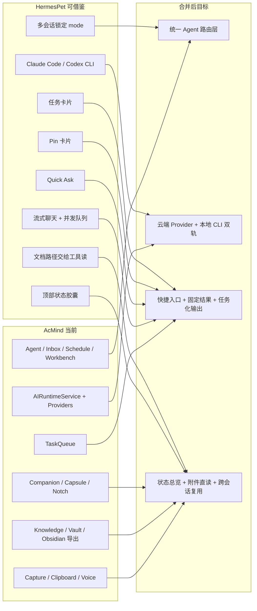

# HermesPet 合并映射

> 说明：这份文档用于把 HermesPet 的能力映射到 AcMind 当前结构里，方便后续按模块合并。
> 这里把 `9 / 11 / 12` 暂时排除，只看剩余的可合并能力。

## 1. 功能前后对比

| 维度 | 合并前：AcMind 当前状态 | 合并后：目标状态 |
|---|---|---|
| 多会话聊天 | 已有 `Agent` 会话列表、文件夹、历史归档 | 保留现有会话体系，补齐更强的“会话锁定 + 模式切换 + 快速切会话”体验 |
| AI 后端 | 以本地/云端 provider 为主，统一走 `AIRuntimeService` | 同时支持云端 Provider + 本地 CLI 智能体，形成统一路由层 |
| 本地 CLI 智能体 | 基本缺失 | 增加 Claude Code / Codex 这类“读写文件、跑命令”的执行后端 |
| 流式对话 | 已有流式能力基础，但 UI 更偏结果导向 | Agent 输入与回复都能更像 HermesPet 一样即时反馈、持续流式展示 |
| 快速入口 | 主要依赖主窗口、侧边栏、系统热键 | 增加 Quick Ask 轻入口，做到“一句即走，不打断主工作流” |
| 结果固定 | 以知识卡、任务、文档为主 | 增加 Pin 式固定结果，让高价值回复能被快速回收复用 |
| 任务形态 | 已有任务/待办/日程执行 | 增加 HermesPet 风格的任务分解和卡片化执行入口 |
| 状态反馈 | 有顶部胶囊/面板/Badge | 增强为“当前后端、当前会话、当前执行状态”一眼可见 |
| 附件使用 | 以采集、蒸馏、导入为主 | 更强调“把原始文件交给智能体工具链自己读” |

## 2. 能力映射图

## 3. 合并优先级

### P0

- Claude Code / Codex 本地 CLI 接入
- 会话锁定 mode 的一致化
- 流式输出的统一体验

### P1

- Quick Ask 轻入口
- Pin 式结果固定
- 任务卡片化输出

### P2

- 更强的状态胶囊联动
- 附件“路径直读”模式
- 会话与知识卡之间的互转

## 4. 当前仓库里最适合的落点

- `App/AppDelegate.swift`
  - 全局快捷键、窗口入口、状态联动
- `Features/Native/Agent/`
  - Agent 会话、执行结果、任务卡、快速入口
- `AcMindKit/Services/AI/`
  - Provider 路由、流式、CLI 适配、任务队列
- `Features/Companion/`
  - Capsule / Notch / 顶部状态反馈

## 5. 备注

- AcMind 已经有不少 HermesPet 的“底层能力影子”，比如多会话、任务队列、快捷键和顶部胶囊。
- 真正值得补的是“本地 CLI 智能体”和“交互层的结果固定/快速入口”。
- 这份文档只做合并地图，不替代具体实现。

