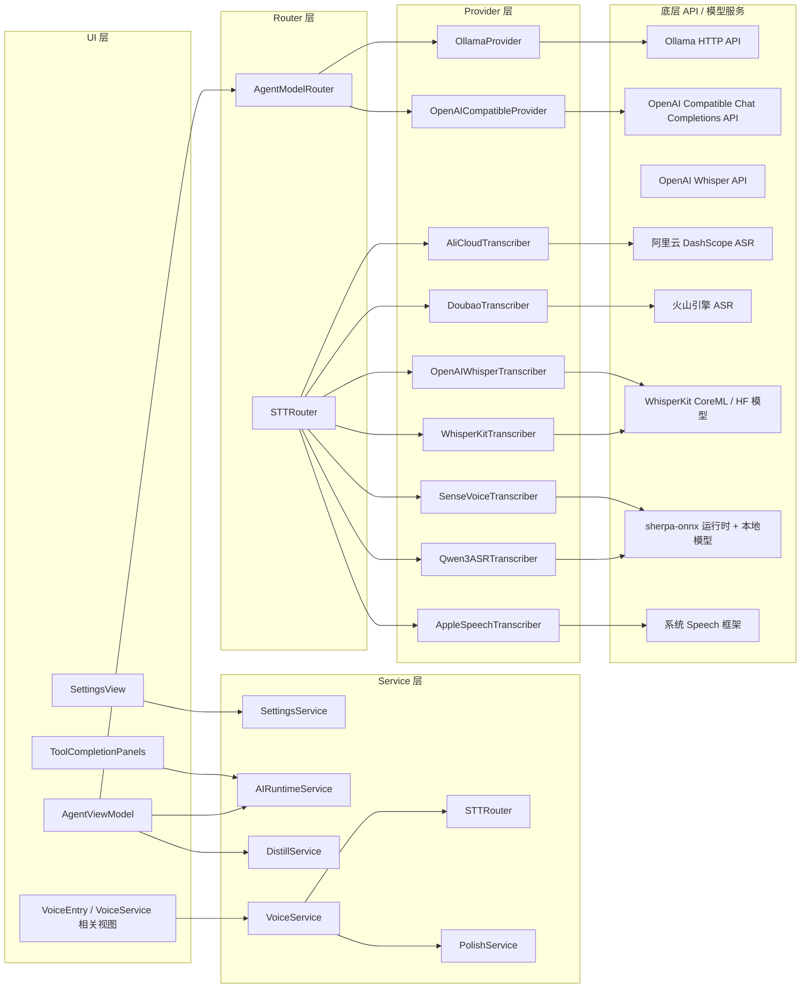

# AcMind 模型调用架构说明

> 生成日期：2026-05-27
>
> 目标：系统性梳理 AcMind 当前所有可调用的模型接口，并把 `UI -> Service -> Router -> Provider -> API` 的完整调用链路串起来，方便后续扩展、排查和配置。

## 1. 范围说明

本文档覆盖两条独立链路：

1. 文本 / 对话 / 蒸馏链路
2. 语音识别（STT）链路

这两条链路共用“服务容器 + 配置 + Keychain/API Key”的基础设施，但在路由与 Provider 实现上是分开的。

---

## 2. 总体调用链路

---

## 3. UI 层入口

### 3.1 设置页

主要入口：

- [`Features/Native/Settings/SettingsView.swift`](../Features/Native/Settings/SettingsView.swift)
- [`App/ViewModels/SettingsViewModel.swift`](../App/ViewModels/SettingsViewModel.swift)

UI 侧会调用：

- Provider 列表加载
- Provider 增删改查
- 模型列表拉取
- Provider 健康检查
- Chat 测试调用

对应链路：

`SettingsView -> SettingsViewModel -> SettingsService / AIRuntimeService`

### 3.2 模型测试面板

主要入口：

- [`Features/Native/Tools/ToolCompletionPanels.swift`](../Features/Native/Tools/ToolCompletionPanels.swift)

UI 侧会调用：

- `listProviders()`
- `healthCheck(providerId:)`
- `listModels(providerId:)`
- `chat(messages:providerId:model:)`

对应链路：

`ToolCompletionPanels -> AIRuntimeService -> Provider`

### 3.3 Agent / 蒸馏入口

主要入口：

- [`App/ViewModels/AgentViewModel.swift`](../App/ViewModels/AgentViewModel.swift)
- [`AcMindKit/Services/Workflow/DistillService.swift`](../AcMindKit/Services/Workflow/DistillService.swift)

UI 侧触发：

- 文本保存到 Inbox
- 文本蒸馏
- 语音录入后回填文本

对应链路：

`AgentViewModel -> DistillService -> AIRuntimeService -> Provider`

### 3.4 语音入口

主要入口：

- [`App/ViewModels/AgentViewModel.swift`](../App/ViewModels/AgentViewModel.swift)
- [`AcMindKit/Services/Voice/VoiceService.swift`](../AcMindKit/Services/Voice/VoiceService.swift)
- 相关语音界面组件

对应链路：

`Voice UI -> VoiceService -> STTRouter -> STT Provider / Model API`

---

## 4. Service 层职责

### 4.1 `SettingsService`

文件：

- [`AcMindKit/Services/Settings/SettingsService.swift`](../AcMindKit/Services/Settings/SettingsService.swift)

职责：

- 管理应用设置
- 管理 Provider 配置
- 管理默认 Provider / 默认 Model
- 负责把 API Key 存到 Keychain

对模型调用的影响：

- 决定默认 Provider ID / Model ID
- 决定 Provider 配置是否可用
- 为 `AIRuntimeService` 提供初始化所需数据

### 4.2 `AIRuntimeService`

文件：

- [`AcMindKit/Services/AI/AIRuntimeService.swift`](../AcMindKit/Services/AI/AIRuntimeService.swift)

职责：

- Provider 管理
- 普通 Chat
- 流式 Chat
- 模型列表
- 健康检查
- 蒸馏任务

直接能力：

- `listProviders()`
- `addProvider(_:)`
- `updateProvider(_:)`
- `removeProvider(id:)`
- `healthCheck(providerId:)`
- `listModels(providerId:)`
- `chat(messages:)`
- `chat(messages:providerId:model:)`
- `chatStream(messages:)`
- `runDistillation(sourceItem:)`

说明：

- `AIRuntimeService` 是当前文本模型的实际执行层。
- 它不会自动调用 `AgentModelRouter`；如果需要按任务类型路由，调用方应先通过路由器拿到 `providerId` / `modelId`，再传入 `chat(messages:providerId:model:)`。

### 4.3 `DistillService`

文件：

- [`AcMindKit/Services/Workflow/DistillService.swift`](../AcMindKit/Services/Workflow/DistillService.swift)

职责：

- 组装蒸馏 prompt
- 调用 AI Runtime
- 解析蒸馏结果
- 持久化 `DistilledNote`

它不直接接 API，而是复用 `AIRuntimeService.chat(...)`。

### 4.4 `VoiceService`

文件：

- [`AcMindKit/Services/Voice/VoiceService.swift`](../AcMindKit/Services/Voice/VoiceService.swift)

职责：

- 录音
- 调用 STT
- 调用文本润色
- 回填转写结果

它内部会把语音链路拆成两段：

1. 转写：`STTRouter`
2. 润色：`PolishService` / `AIRuntimeService`

### 4.5 `PolishService`

文件：

- [`AcMindKit/Services/Voice/Polish/PolishService.swift`](../AcMindKit/Services/Voice/Polish/PolishService.swift)

职责：

- 对转写文本做润色
- 支持自由指定 `providerId` / `model`
- 支持流式和非流式

本质上仍然调用 `AIRuntimeService.chat(...)`。

---

## 5. Router 层职责

### 5.1 `AgentModelRouter`

文件：

- [`AcMindKit/Services/Agent/AgentModelRouter.swift`](../AcMindKit/Services/Agent/AgentModelRouter.swift)

职责：

- 根据任务类型给出推荐 `providerId` 和 `modelId`
- 估算成本
- 记录模型消耗

定位说明：

- 这是一个**独立的逻辑路由器**，用于为 Agent 场景提供推荐模型选择。
- 当前默认 `AIRuntimeService` 路径不会自动接入它。
- 如果要使用它，通常应由上层先调用 `route(request:)`，再把结果传给 `AIRuntimeService.chat(messages:providerId:model:)`。

任务类型与默认映射：

| TaskType | 默认 Provider | 默认 Model |
|---|---|---|
| `simpleChat` | `ollama` | `llama3` |
| `textSummarize` | `ollama` | `llama3` |
| `longTextProcess` | `deepseek` | `deepseek-chat` |
| `codeGeneration` | `openai` | `gpt-4o-mini` |
| `codeReview` | `anthropic` | `claude-sonnet-4-20250514` |
| `complexReasoning` | `anthropic` | `claude-3-5-haiku-20241022` |
| `vision` | `openai` | `gpt-4o` |
| `voice` | `ollama` | `whisper` |

说明：

- 这是一张“默认路由表”，不是强制绑定。
- 真正执行调用时，仍由 `AIRuntimeService` 根据 `providerId` 和 `model` 去完成。

### 5.2 `STTRouter`

文件：

- [`AcMindKit/Services/Voice/STT/STTRouter.swift`](../AcMindKit/Services/Voice/STT/STTRouter.swift)

职责：

- 选择当前语音识别 Provider
- 延迟初始化具体 transcriber
- 处理预热逻辑
- 对失败路径做兼容回退

当前支持的 STT Provider：

- `senseVoice`
- `whisperKit`
- `qwen3ASR`
- `appleSpeech`
- `openAI`
- `aliCloud`
- `doubao`

---

## 6. Provider 层与底层 API

### 6.1 文本 / 对话 Provider

#### `OllamaProvider`

文件：

- [`AcMindKit/Services/AI/Providers/OllamaProvider.swift`](../AcMindKit/Services/AI/Providers/OllamaProvider.swift)

底层 API：

- `POST /api/chat`
- `GET /api/tags`
- `POST /api/pull`

默认模型：

- `llama2`

返回模型列表的方式：

- 从 `/api/tags` 的 `models[].name` 提取

#### `OpenAICompatibleProvider`

文件：

- [`AcMindKit/Services/AI/Providers/OpenAICompatibleProvider.swift`](../AcMindKit/Services/AI/Providers/OpenAICompatibleProvider.swift)

底层 API：

- `POST /v1/chat/completions`
- `GET /v1/models`

默认模型：

- `gpt-3.5-turbo`

适用范围：

- OpenAI API
- Azure OpenAI
- 其他兼容 `/v1/chat/completions` 的服务

说明：

- 代码里将 `anthropic`、`google` 也映射到这个 Provider 实现。
- 这意味着“接口层统一”，但实际能否使用，取决于你配置的 baseURL 是否提供兼容协议。

### 6.2 语音识别 Provider

#### `OpenAIWhisperTranscriber`

文件：

- [`AcMindKit/Services/Voice/STT/Cloud/OpenAIWhisperTranscriber.swift`](../AcMindKit/Services/Voice/STT/Cloud/OpenAIWhisperTranscriber.swift)

底层 API：

- `POST https://api.openai.com/v1/audio/transcriptions`

默认模型：

- `whisper-1`

#### `AliCloudTranscriber`

文件：

- [`AcMindKit/Services/Voice/STT/Cloud/AliCloudTranscriber.swift`](../AcMindKit/Services/Voice/STT/Cloud/AliCloudTranscriber.swift)

底层 API：

- `wss://dashscope.aliyuncs.com/api-ws/v1/inference`

默认模型：

- `paraformer-realtime-v2`

#### `DoubaoTranscriber`

文件：

- [`AcMindKit/Services/Voice/STT/Cloud/DoubaoTranscriber.swift`](../AcMindKit/Services/Voice/STT/Cloud/DoubaoTranscriber.swift)

底层 API：

- `https://openspeech.bytedance.com/api/v1/asr`

说明：

- 该实现采用 HTTP 上传音频的简化方式。
- 代码中没有单独暴露“模型名字段”，而是直接面向 API 服务。

#### `WhisperKitTranscriber`

文件：

- [`AcMindKit/Services/Voice/STT/Local/WhisperKitTranscriber.swift`](../AcMindKit/Services/Voice/STT/Local/WhisperKitTranscriber.swift)

底层实现：

- WhisperKit CoreML / Hugging Face 模型

可选模型尺寸：

- `tiny`
- `base`
- `small`
- `medium`
- `large`
- `large-v3`
- `large-v3-turbo`

默认值：

- `large-v3-turbo`

#### `SenseVoiceTranscriber`

文件：

- [`AcMindKit/Services/Voice/STT/Local/SenseVoiceTranscriber.swift`](../AcMindKit/Services/Voice/STT/Local/SenseVoiceTranscriber.swift)

底层实现：

- `sherpa-onnx`
- 本地模型文件

默认模型标识：

- `csukuangfj/sherpa-onnx-sense-voice-zh-en-ja-ko-yue-2024-07-17`

#### `Qwen3ASRTranscriber`

文件：

- [`AcMindKit/Services/Voice/STT/Local/Qwen3ASRTranscriber.swift`](../AcMindKit/Services/Voice/STT/Local/Qwen3ASRTranscriber.swift)

底层实现：

- `sherpa-onnx`
- 本地模型文件

默认模型标识：

- `Qwen/Qwen3-ASR-0.6B`

#### `AppleSpeechTranscriber`

文件：

- [`AcMindKit/Services/Voice/STT/Local/AppleSpeechTranscriber.swift`](../AcMindKit/Services/Voice/STT/Local/AppleSpeechTranscriber.swift)

底层实现：

- 系统 Speech 框架

说明：

- 不依赖外部模型名。
- 作为兜底兼容路径使用。

---

## 7. 当前可调用模型清单

### 7.1 文本 / 对话 / 蒸馏

| Provider | 模型 | 来源 | 说明 |
|---|---|---|---|
| `ollama` | `llama2` | 代码默认值 | `OllamaProvider` 默认模型 |
| `ollama` | `llama3` | Agent 默认路由 | `simpleChat` / `textSummarize` 默认模型 |
| `deepseek` | `deepseek-chat` | Agent 默认路由 | `longTextProcess` 默认模型 |
| `openai` | `gpt-3.5-turbo` | 代码默认值 | `OpenAICompatibleProvider` 默认模型 |
| `openai` | `gpt-4o-mini` | Agent 默认路由 / 定价表 | `codeGeneration` 默认模型 |
| `openai` | `gpt-4o` | Agent 默认路由 / 定价表 | `vision` 默认模型 |
| `anthropic` | `claude-sonnet-4-20250514` | Agent 默认路由 / 定价表 | `codeReview` 默认模型 |
| `anthropic` | `claude-3-5-haiku-20241022` | Agent 默认路由 / 定价表 | `complexReasoning` 默认模型 |

### 7.2 语音识别 / 转写

| Provider | 模型 | 来源 | 说明 |
|---|---|---|---|
| `openai` | `whisper-1` | 代码默认值 | OpenAI Whisper API |
| `aliCloud` | `paraformer-realtime-v2` | 代码内固定值 | DashScope ASR |
| `whisperKit` | `tiny` / `base` / `small` / `medium` / `large` / `large-v3` / `large-v3-turbo` | 代码定义 | WhisperKit 本地模型 |
| `senseVoice` | `csukuangfj/sherpa-onnx-sense-voice-zh-en-ja-ko-yue-2024-07-17` | 代码定义 | sherpa-onnx 本地模型 |
| `qwen3ASR` | `Qwen/Qwen3-ASR-0.6B` | 代码定义 | sherpa-onnx 本地模型 |
| `doubao` | 无显式模型名 | API 固定服务 | 火山引擎 ASR |
| `appleSpeech` | 无显式模型名 | 系统框架 | 系统听写 |

---

## 7.3 模型槽位推荐表

> 说明：
>
> - 本节分成两张表，分别描述**当前现状**与**推荐选型**。
> - 推荐顺序固定为：`Agent 对话` -> `STT` -> `文本清理 / 润色` -> `Embedding / 检索` -> `视觉理解` -> `长文本 / 重推理`
> - 当前现状严格按照仓库里已存在的实现、路由和默认值描述，不补不存在的能力。

### 7.3.1 现状表

| 优先级 | 模型槽位 | 主要职责 | 当前现状 | 是否独立 | 备注 |
|---|---|---|---|---|---|
| 1 | Agent 对话模型 | 日常问答、摘要、改写、任务处理、推理 | 已接入，`AIRuntimeService.chat(...)` 为实际执行层；`AgentModelRouter` 提供默认路由 | 是 | 当前可走 `ollama` / `openAI` / `anthropic` / `deepseek` 等配置 |
| 2 | STT 语音转文字模型 | 录音后快速转写 | 已接入，`STTRouter` 支持 `senseVoice` / `whisperKit` / `qwen3ASR` / `openAI` / `aliCloud` / `doubao` / `appleSpeech` | 是 | 是独立链路，不经过文本 LLM 路由 |
| 3 | 文本清理 / 润色模型 | 将口语或转写文本整理为更自然、更结构化的内容 | 已接入，`PolishService` 复用 `AIRuntimeService.chat(...)` | 可独立 | 当前可由同一个模型承担，也可单独配置 |
| 4 | Embedding / 检索模型 | 语义检索、相似内容召回、知识库搜索 | 未形成独立实现或路由 | 是 | 当前仓库未见独立 embedding provider / index pipeline |
| 5 | 视觉理解模型 | 截图、图片、界面识别 | 有路由语义与任务类型定义，但未见独立视觉 Provider / 调用管线 | 可独立 | `AgentModelRouter` 有 `vision -> openai/gpt-4o` 的默认建议 |
| 6 | 长文本 / 重推理模型 | 长上下文处理、复杂推理、代码审查 | 有默认路由建议，实际由文本 LLM 统一执行 | 可独立 | 目前可通过 Agent 入口走到对应模型，但未做更细的专线封装 |

### 7.3.2 推荐表

| 优先级 | 模型槽位 | 主要职责 | 推荐模型 / 供应商 | 是否独立 | 备注 |
|---|---|---|---|---|---|
| 1 | Agent 对话模型 | 日常问答、摘要、改写、任务处理、推理 | `ollama/llama3` 或 `openai/gpt-4o-mini` 作为主用；云端增强可补 `anthropic/claude-sonnet-4-20250514` | 是 | 主脑模型，建议优先稳定与可用性 |
| 2 | STT 语音转文字模型 | 录音后快速转写 | 本地优先 `whisperKit` 或 `senseVoice`；云端备选 `openAI/whisper-1` | 是 | 以延迟、稳定性和离线能力优先 |
| 3 | 文本清理 / 润色模型 | 口语整理、转写清洗、结构化输出 | `openai/gpt-4o-mini` 或 `ollama/llama3` | 建议独立 | 建议和 Agent 分离，降低主模型负载 |
| 4 | Embedding / 检索模型 | 语义检索、相似召回、知识库搜索 | `bge-m3` / `nomic-embed-text` / 同类 embedding 服务 | 是 | 建议尽早补齐，适合知识中枢产品 |
| 5 | 视觉理解模型 | 截图、图片、界面识别 | `openai/gpt-4o` | 可独立 | 如果视觉采集权重高，可提前到第 4 位 |
| 6 | 长文本 / 重推理模型 | 长上下文处理、复杂推理、代码审查 | `anthropic/claude-sonnet-4-20250514` 或更强的长上下文模型 | 可独立 | 作为增强层，按预算和场景逐步补齐 |

### 7.3.3 推荐顺序说明

1. **Agent 对话模型**
   - 这是主脑，承接日常问答、摘要、改写、任务处理和大部分推理。
2. **STT 语音转文字模型**
   - 这是高频输入入口，建议优先保证转写速度和离线可用性。
3. **文本清理 / 润色模型**
   - 作为前处理层，把语音转写和碎片文本变成更可用的输入。
4. **Embedding / 检索模型**
   - 这是知识中枢型产品非常关键的一层，决定“找得到内容”的能力。
5. **视觉理解模型**
   - 如果截图/图片输入是重点，可以提前到更高优先级。
6. **长文本 / 重推理模型**
   - 更偏增强能力，通常可以先由 Agent 主模型部分承担。

---

## 8. 配置与默认值

### 8.1 Provider 配置

`ProviderConfig` 定义在：

- [`AcMindKit/Models/DistilledNote.swift`](../AcMindKit/Models/DistilledNote.swift)

关键字段：

- `providerType`
- `baseURL`
- `modelId`
- `apiKeyRef`
- `enabled`

`ProviderType.defaultBaseURL`：

- `ollama` -> `http://localhost:11434`
- `openAI` -> `https://api.openai.com`
- `anthropic` -> `https://api.anthropic.com`
- `google` -> `https://generativelanguage.googleapis.com`
- `openAICompatible` / `local` -> 空字符串，由配置决定

### 8.2 价格表

默认定价表定义在：

- [`PricingConfig.defaultPricing`](../AcMindKit/Models/ModelRoutingTypes.swift)

当前包含：

- `openai/gpt-4o`
- `openai/gpt-4o-mini`
- `anthropic/claude-sonnet-4-20250514`
- `anthropic/claude-3-5-haiku-20241022`
- `deepseek/deepseek-chat`
- `ollama/local`

说明：

- 价格表主要用于 `AgentModelRouter` 的成本估算。
- 它不限制可调用模型，只影响展示和成本计算。

---

## 9. 关键实现约束

1. `AIRuntimeService` 是文本模型的统一入口，不建议在 UI 层直接绕过它调用 Provider。
2. `AgentModelRouter` 负责“推荐”，不是强制执行。
3. `STTRouter` 与文本 LLM 路由完全独立。
4. `anthropic` 和 `google` 当前在代码里通过 `OpenAICompatibleProvider` 复用实现，属于“统一兼容层”，不是单独的专用 Provider。
5. `OllamaProvider` 与 `OpenAICompatibleProvider` 都支持 `listModels()`，所以 UI 层可以统一做模型拉取。
6. `VoiceService` 中的语音转写和文本润色是两个不同子链路，不要混为一个模型入口。

---

## 10. 建议的后续维护方式

如果后续新增模型，建议按下面顺序补齐：

1. 在 `ProviderType` 或 `STTProvider` 中增加枚举值
2. 在对应 Router 中加入默认路由
3. 在 Provider / Transcriber 中增加具体实现
4. 在 `defaultPricing` 或模型配置表中补价格
5. 在 UI 的测试面板中补一个可见入口

这样可以保证文档、路由、UI 三者保持一致。
